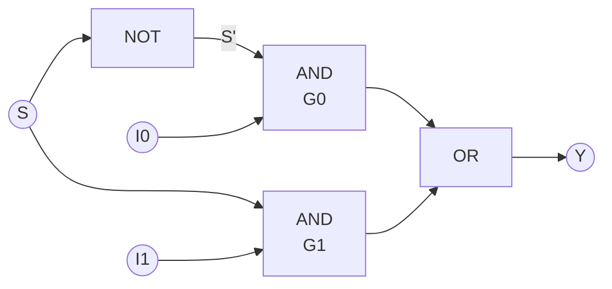
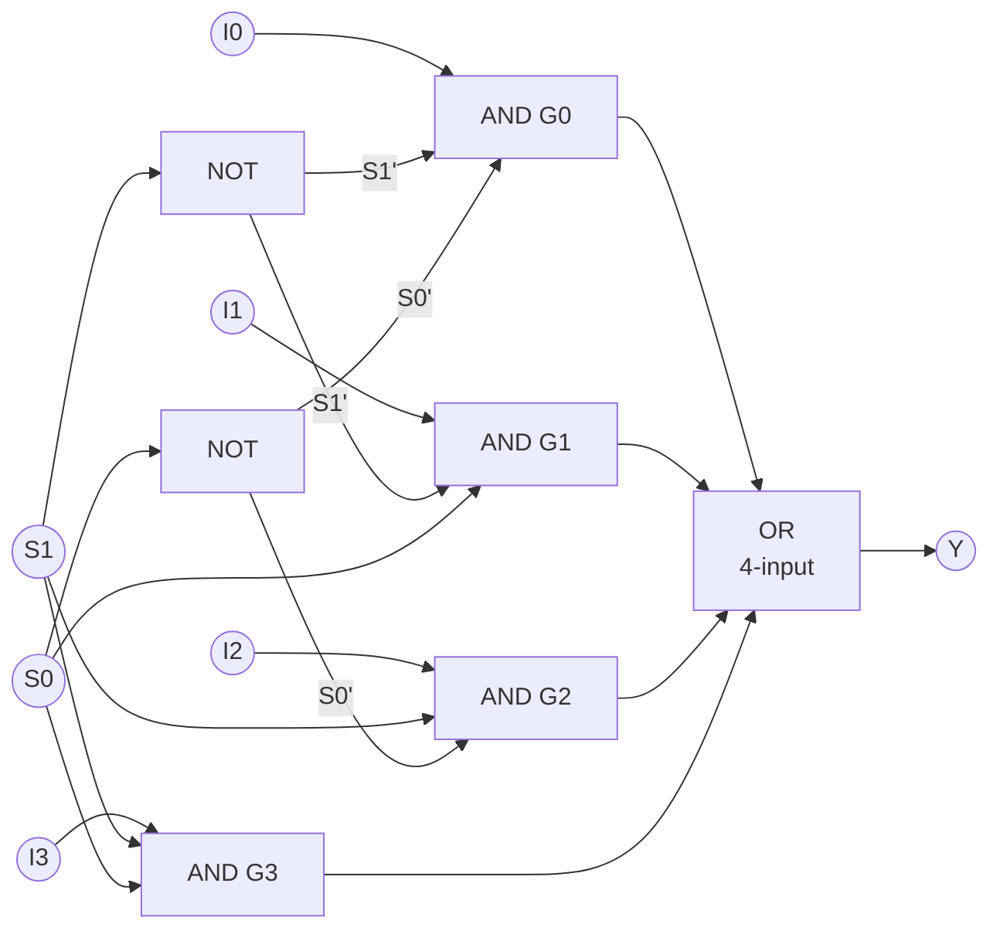
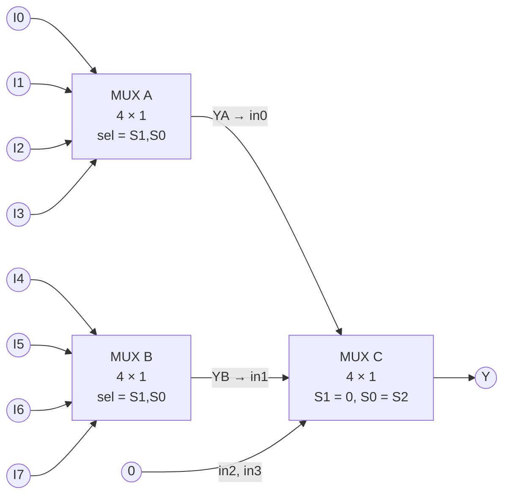
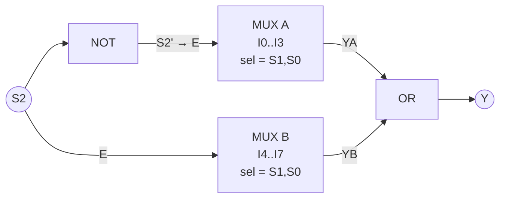

# Multiplexer Circuit Diagrams

Gate-level and block-level circuits for the 2 × 1, 4 × 1 and 8 × 1 MUXes.
(Mermaid diagrams render directly on GitHub; ASCII versions are included for
copying into lab notebooks.)

---

## 1. 2 × 1 MUX — gate level

`Y = S'·I0 + S·I1`



```
                ┌─────┐
   S ───┬──────►│ NOT ├───► S'
        │       └─────┘
        │
   I0 ──────────────┐
                    │   ┌───────┐
   S' ──────────────┴──►│ AND0  ├───┐
                        └───────┘   │   ┌──────┐
                                    ├──►│  OR  ├───► Y
   I1 ──────────────┐   ┌───────┐   │   └──────┘
                    ├──►│ AND1  ├───┘
   S  ──────────────┘   └───────┘
```

Gates: 1 NOT, 2 AND (2-input), 1 OR (2-input).

---

## 2. 4 × 1 MUX — gate level

`Y = S1'S0'·I0 + S1'S0·I1 + S1S0'·I2 + S1S0·I3`



```
          ┌─────┐                 ┌─────┐
 S1 ──┬──►│ NOT ├─► S1'    S0 ─┬─►│ NOT ├─► S0'
      │   └─────┘              │  └─────┘
      │                        │

   I0 ──┐
   S1' ─┼──┐  ┌────────┐
   S0' ─┴──┴─►│  AND0  ├──────────┐
              └────────┘          │
   I1 ──┐                         │
   S1' ─┼──┐  ┌────────┐          │
   S0  ─┴──┴─►│  AND1  ├──────────┤    ┌──────────┐
              └────────┘          ├───►│    OR    ├──► Y
   I2 ──┐                         │    │ 4-input  │
   S1 ──┼──┐  ┌────────┐          │    └──────────┘
   S0' ─┴──┴─►│  AND2  ├──────────┤
              └────────┘          │
   I3 ──┐                         │
   S1 ──┼──┐  ┌────────┐          │
   S0 ──┴──┴─►│  AND3  ├──────────┘
              └────────┘
```

Gate input map:

| Gate | Inputs          | Active when |
|------|-----------------|-------------|
| AND0 | S1', S0', I0    | S1 S0 = 00  |
| AND1 | S1', S0 , I1    | S1 S0 = 01  |
| AND2 | S1 , S0', I2    | S1 S0 = 10  |
| AND3 | S1 , S0 , I3    | S1 S0 = 11  |

Gates: 2 NOT, 4 AND (3-input), 1 OR (4-input).
The four AND gates are exactly the four outputs of a 2-to-4 decoder, each
gated by its data input — so a 4 × 1 MUX = 2-to-4 decoder + 4 AND + 1 OR.

With an enable `E`, every AND gate takes `E` as a fourth input; `E = 0` forces
`Y = 0`.

---

## 3. 8 × 1 MUX — block level, from three 4 × 1 blocks



```
   I0 ─►┐                                MUX C  (4 × 1 used as 2 × 1)
   I1 ─►│  MUX A  │── YA ───────────────► in0 ┐
   I2 ─►│  4 × 1  │                           │
   I3 ─►┘                                     ├──► Y
         ▲   ▲                                │
        S1   S0        YB ──────────────► in1 ┘
                        ▲                0 ─► in2
   I4 ─►┐               │                0 ─► in3
   I5 ─►│  MUX B  │─────┘                     ▲    ▲
   I6 ─►│  4 × 1  │                          S1   S0
   I7 ─►┘                                     │    │
         ▲   ▲                                0    S2
        S1   S0
```

`S1 S0` select the position inside each group of four; `S2` selects the group.
MUX C has its own `S1` tied to 0, so it only ever picks `in0` (= YA, when
S2 = 0) or `in1` (= YB, when S2 = 1). `in2`/`in3` are grounded.

**Cost: 3 × 4 × 1 MUX, no extra gates.**

### Enable variant — two blocks + OR



Exactly one block is enabled at a time, so the disabled one drives 0 and
`Y = YA + YB`.

**Cost: 2 × 4 × 1 MUX + 1 NOT + 1 OR.**
